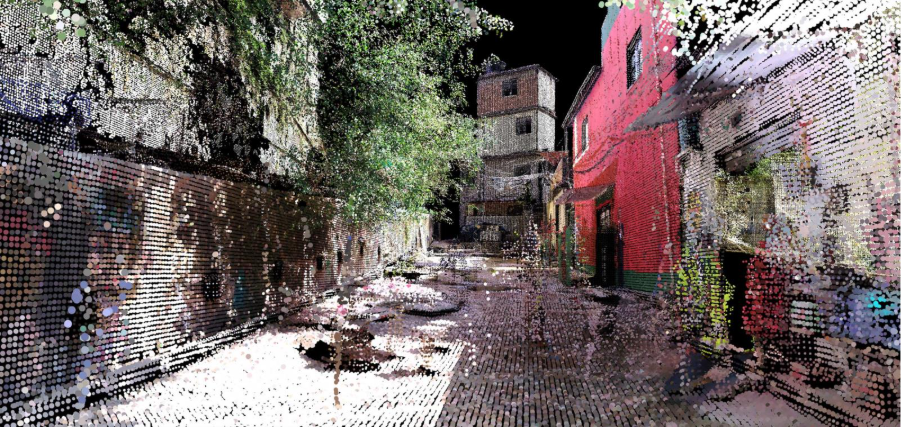

## Why use this method? 
3D scanning, particularly LiDAR (Light Detection and Ranging), is a useful tool for urban analysis, providing precise, high-resolution 3D data of environments. 3D models provide a strong base for a variety of analyses, such as visibility analysis, wind analysis, solar potential, and many others.\ 

3D data of the Netherlands is already available from [3D-BAG](https://3dbag.nl/en/viewer), which is an open dataset created in 2008 with 99% validity.\

However, especially in your own graduation project, you might find yourself working in sites where such data is incomplete, not so precise, or non-existent altogether. In that case, it can be useful to create your own model using the steps below.\

## How does LiDAR work?
LiDAR is a remote sensing technology that works by emitting laser pulses towards a surface. These pulses travel to the target and back to the sensor and, based on the time it takes for them to return, the system calculates the distance to the target, known as the "time of flight."  Using this distance, the system calculates the exact 3D coordinates (X, Y, Z) of the point where the pulse has reflected, creating a “point” in 3D space. This process is repeated rapidly, generating millions of data points, which together form a dense "point cloud" that can be used to construct highly detailed models of the environment.\

LiDAR can be deployed from various platforms: airborne for large-scale mapping, drones for smaller, more specific areas, ground-based for detailed mapping of buildings and infrastructure, and mobile (vehicle-mounted) for road and urban mapping.\

In the Favelas 4D project by MIT Senseable City Lab, LiDAR scans taken at street level were used to map Rocinha, the largest favela in Rio de Janeiro. The high precision of the resulting 3D dataset enables morphological analysis of the streets and buildings that constitute this settlement. Informal forms of urbanism are often unrepresented by traditional mapping methods, but here the spatial logics of the favela are made visible.\

{#fig-urban-taxonomy fig-align="center"}

## You are ready to use this method if
- You understand how LiDAR works.  

- You have installed COLMAP and CloudCompare 

- You have access to scanning equipment (camera, 360 camera or a smartphone)

## Questions you can answer 
- What kinds of analyses can 3D models be used for? 

- What is the difference between a point cloud and a mesh model?

## Steps
1. Obtain data for your point cloud.

    Point cloud data can be downloaded from [PDOK](https://www.pdok.nl/) or [AHN](https://www.ahn.nl/) for the Netherlands. For other areas, you can check municipal data portals. You can usually download it in the follow formats: LAS, LAZ, PLY, XYZ, or E57. If there is no point cloud data available, go to step 2. 

2. Create your own point cloud. If data for your site already exists, go to step 3.

    Depending on your resources and project requirements, you can use different techniques to create a point cloud.  
    
      a. Photogrammetry (using a regular camera or smartphone)  
      
          Using a regular camera or smartphone, take several overlapping photos of your chosen object or area from different angles (the bigger the area, the more photographs you will need). You can then use [COLMAP](#tools) to process these images into a point cloud.  
        
      b. iPhone with LiDAR sensor  
      
          Newer iPhones (iPhone 12 Pro or later) feature built-in LiDAR sensors, offering better accuracy than regular photos. This allows for detailed, real-time 3D scans. Apps like [3D Scanner App](#tools) let you create 3D models directly on your phone, making it ideal for small-scale projects.
        
      c. Drone or airplane (for large-scale projects):  
      
          Drones or airplanes equipped with cameras or LiDAR sensors are better for capturing large areas, such as mapping cities or landscapes. Drones offer high resolution and flexibility but come with a higher cost and require more expertise to operate. 
        
3. Create a 3D model from your point cloud.

      a. Import the point cloud data into [CloudCompare](#tools).
      
      b. In CloudCompare, you can preprocess and clean the point cloud if this is needed, as the data may contain noise or irrelevant points. If the data is too large, you can down sample the points or clip the area you want to focus on.  
      
      c. If your data consists of multiple point clouds from different scans or sources, you'll need to align and register them into a single, unified point cloud.  With CloudCompare, you can either automatically align or manually registering multiple point clouds.
      
      d. Once you have a clear, aligned point cloud, you can generate a mesh (a 3D surface model) with the Poisson Surface Reconstruction tools.
      
      e. Once you have a mesh, you can smooth or refine it to better represent the real-world surface.  
      f. You can now export it in various file formats, depending on your needs. Common formats include OBJ, STL, FBX, or PLY. You can even 3D print this! 

## Tools {#tools}
- COLMAP is an open-source photogrammetry tool that performs structure-from-motion (SfM) and multi-view stereo (MVS) to create accurate 3D reconstructions from images. You can find useful instruction manuals [here](https://colmap.github.io/tutorial.html) 

- [3D Scanner App](https://3dscannerapp.com/)  

- Cloud Compare is a free, open-source, 3D point cloud processing software. You can find useful tutorials [here](https://www.cloudcompare.org/)

## Cases
- [3dbag](https://3dbag.nl/en/viewer)

- [Multi roof EU project](https://multiroofs.nweurope.eu/)

- [4D Favela scanning MIT](https://senseable.mit.edu/favelas/)

## References

## Exercises
### Exercise 1 —  Create and explore a 3D model of a street corner
Choose a street corner near you and, following the steps above, create your own point cloud of this area and make it into a model. \

**Tasks**\
1. Select a corner with at least two intersecting streets near you. 

2. Create your own point cloud of your site. 

3. Generate a 3D model from this point cloud.  

4. Spend some time exploring your 3D model: 

    - Where is the model distorted or missing information? 

    - Identify elements that affect street perception and visibility. Are there trees or street signs that obstruct views? 

    - Measure the heights and width of elements. What is the height-to-width ratio of the street? 

5. Reflect on the activity: 

    - What are the limitations of this method? 

    - How can this method contribute to urban planning decision-making? 
    
**Deliverables**\
- Point cloud 

- 3D model 

- Short reflection 

### Exercise 2 —  Analyse and compare your 3D model to a plan of the site
Separately analyse your 3D model and a 2D plan of the same site. You should think about what the limitations and adaptations of different kinds of analyses are.\

**Tasks**\
1. Obtain a map of your site from [OpenStreetMap](https://www.openstreetmap.org/#map=19/52.026411/4.706610&layers=H). 

2. Separately annotate and analyse screenshots of your 3D model and your 2D plan.  

3. Compare the two analyses. 

4. Reflect on the activity: 

    - What is revealed in the 3D analyses that was not present in the 2D map? And vice versa? 

    - Which analysis is more useful in answering different urban questions? 
    
**Deliverables**\
- Screenshot of 3D model with annotations of key spatial features 

- Annotation of 2D plan with key spatial features 

- Short reflection 