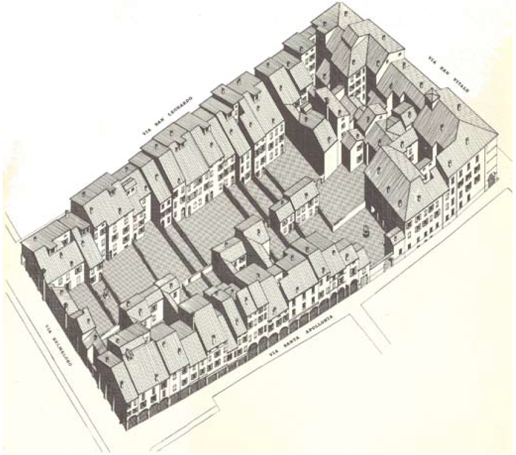

{#fig-bologna fig-align="center"}

This is a good example of an analysis in the Italian tradition. Typically, these are based on meticulous surveys of the city. For Cervelatti, the most relevant source of knowledge about the city would probably be the building block, its characteristics and especially building typology. Conceptual abstractions like in many contemporary analyses (see for example [Stadsportretten](stadsportretten.qmd), [Costa Iberica](costa_iberica.qmd), [Belvedere Bouwen](belvedere_bouwen.qmd)) are obviously of a totally different nature. This analysis of Bologna begins with the city as a whole, but the information contained in the drawings is derived from a lower scale level. The drawings are not supposed to uncover a hidden truth about the city; they merely document its parts. In analyses like these, the factual information derived from a survey is as valuable and usable for design and policy as the conceptual force of many recent analyses. 