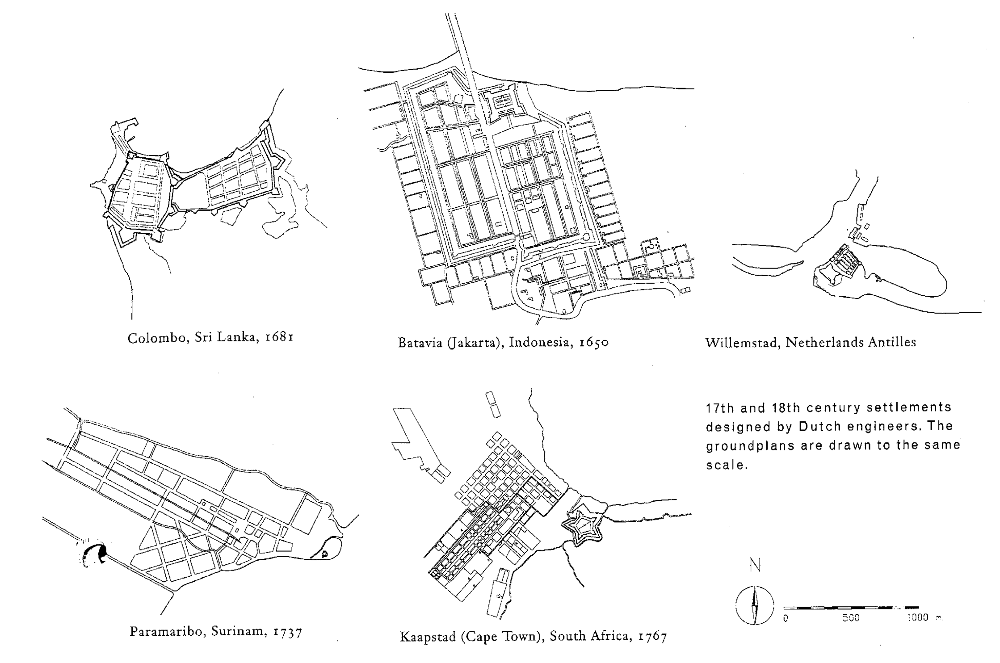

{#fig-colonial fig-align="center"}

In the 1990s, the late Professor Van Voorden was involved in the development of a masters course in the redesign and conservation of historical inner cities. In this course, Van Voorden wanted to view historical buildings and cities in a broad socio-economic perspective, requiring analyses in which the development of the morphology of cities is connected to these broader issues. The drawings shown here are taken from a PHd. Research by Ron van Oers into the development of 17th century Dutch colonial settlements. Of course, these drawings were originally illustrations to a text. Here, we show them outside of their proper context, but in themselves, the drawings are beautiful examples of how an analysis can quickly produce insight into complex material. In Figure 35.1, for instance, shows six colonial settlements and how an abstract scheme like Stevin’s plan was modified in practice to suit local circumstances.