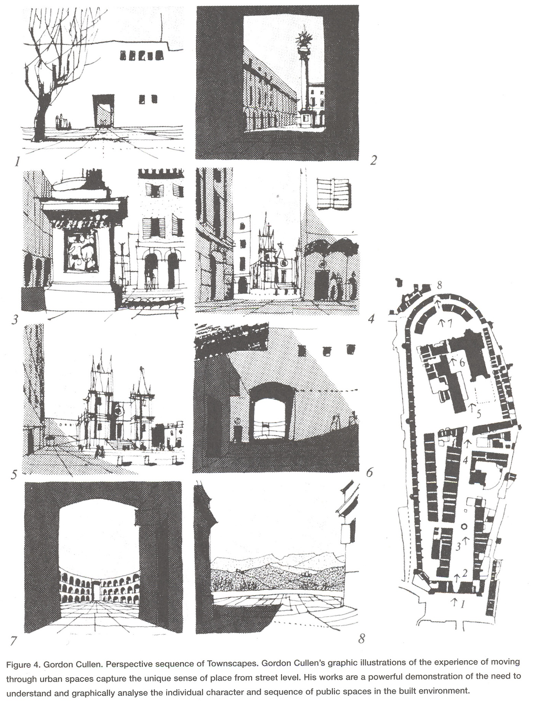

{#fig-concise-townscape fig-align="center"}
These drawings make the reader aware of the many different “scenes” in a city. These scenes can be drawn, named and understood. This is valuable information for urban designers since it represents some of the basic elements in the city and how these are connected through the movement of people. For Cullen, the city has qualities related to space and movement that cannot be represented in 2d. This is not unlike the idea behind the perspective drawings in for example “Elements d’Analyse Urbaine” (project 11) or “Die Städtebau nach seinen Künstlerischen Grundsätzen” (project 2). Cullen proposed no method for design; he primarily wanted to point out the beauty and importance of these spaces in the city. Please note that photographs would not have had the same effect. By drawing, Cullen had to be precise as to what was relevant and what not. His drawings are in fact analyses. \

Also see:
Project 11, [Elements d’Analyse Urbaine](elements_urbaine.qmd)\
Project 2, [Die Städtebau nach seinen Künstlerischen Grundsätzen](stadtebau.qmd)

## Why use this method? 

## How does it work?

## You are ready to use this method if

## Questions you can answer 

## Steps

## Tools {#tools}

## Cases

## References

## Exercises

