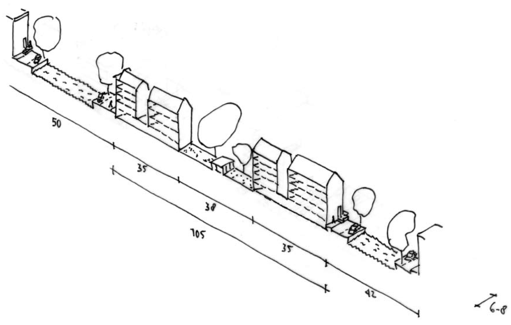

{#fig-nieuwe-oude-jas fig-align="center"}

Building blocks are often the basic material with which cities are built. Block sizes are inseparably connected to building typology. Width and height of a block limit the choice of buildings that will fit in and therefore influence the profitability of a plan. Block size and building typology also shape the city streets and interior spaces and consequently have a strong influence on the desired atmosphere of an area. Choices in block size and building typology are therefore basic material for urban designers. In this analysis a number of old and new blocks in Amsterdam are compared. It focuses on this relation between buildings and city form. The method can be compared to earlier French and Italian analyses such as [Studi per una Operante Storia Urbana di Venezia](studi_per_una_operante.qmd), [Bologna: politica e metodologia del restauro nei centri storici](bologna.qmd), [Elements d’analyse urbaine](elements_urbaine.qmd), [Lecture d’une ville: Versailles](versailles.qmd) and ["Les Bastides: d’Aquitaine, du Bas-Languedoc et du Béarn"](les_bastides.qmd), although there, the study would typically look into the buildings in more detail.

## Links
[learning from amsterdam](http://janbrouwerstedebouwer.nl/learning-from-amsterdam/)