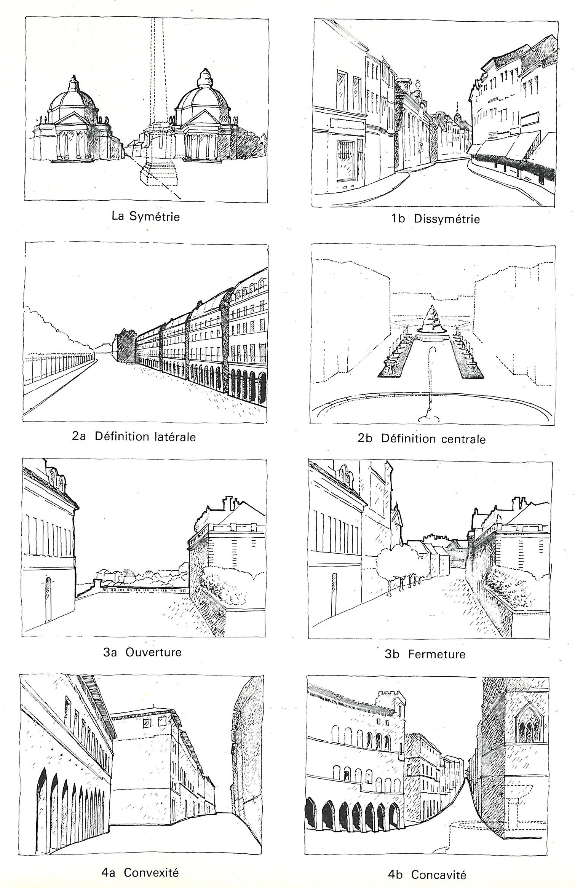

{#fig-element-urbaine fig-align="center"}

Similar to this book, Elements d’analyse urbaine gives general principles and drawing examples for urban analysis. Their modification of the Nolli map and functional analysis below are good examples of simple but effective reduction drawings. Note also the drawings to the right which illustrate different kinds of urban growth. As a representative of the French school of urban analysis, this overview pays much attention to typological research, for example about housing typology in connection to city blocks (p.118). Interesting are the perspective drawings showing basic types of urban scenes. At first glance, the drawings and techniques might look outdated, but many of the examples you see in this book still use the same principles. 