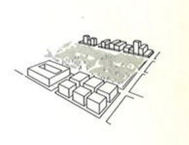
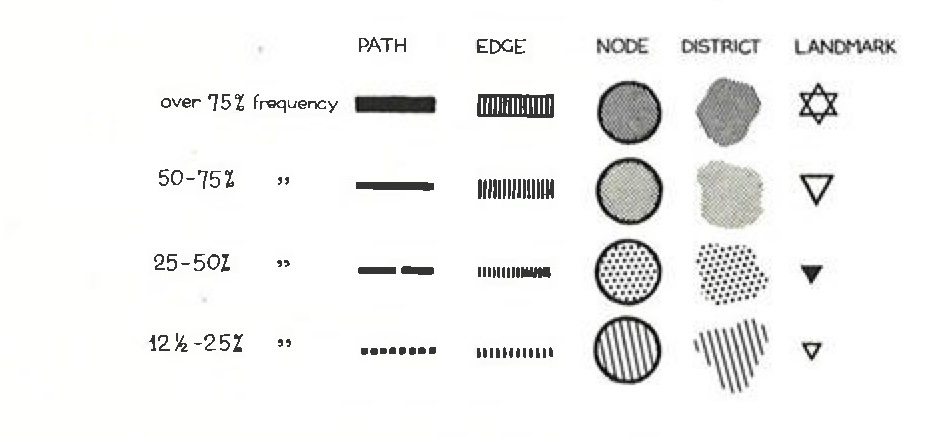

{#fig-kevin-lynch fig-align="center"}

A basic point of urban analysis is that the topographical map is not the only one you can draw to represent a city. Kevin Lynch became famous by drawing maps that were reflective of people’s image of a city; their mental maps. Lynch developed drawing techniques to visualise relationships, borders, important places etc. that are perceivable to city dwellers, but are often invisible; at least on a map. Fig. 1 shows the basic principle that people moving from A to B need visual stimuli to make sense of their environment. Fig. 2 shows some of the basic urban configurations that Lynch drew for his book which people use in their image of the city. In Lynch’s view, it is important to be aware of these mental considerations. Knowing how people find their way in a city and what gives cities or areas their specific character can be a valuable tool for design. This can be done on all scale levels, as is shown in figs. 12 - 17. 

{#fig-kevin-lynch-3 fig-align="center"}

You can find the collection of original drawings [here](https://dome.mit.edu/discover?scope=%2F&query=kevin+lynch+image+of+the+city&submit=Go). 