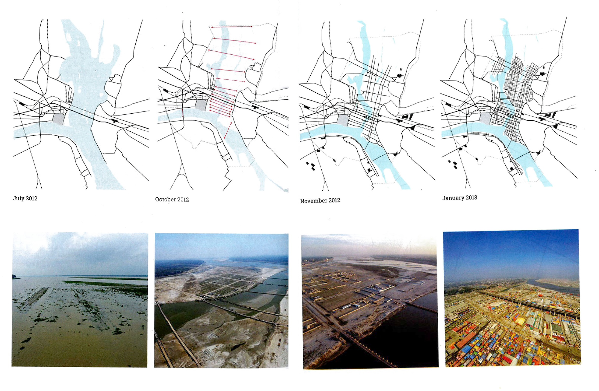

{#fig-kumbh-mela fig-align="center"}

The increased acceleration of human movement challenges permanence as a default condition of the city. It becomes ever more relevant, therefore, to study examples of temporary settlements, or ephemeral urbanisms: over 700 million of the global population are currently living in spaces of flux.\

The Kumbh Mela, a Hindu celebration that takes place every 12 years, is the worlds’ largest religious gathering. It takes places over 55 days in India, on the floodplain between two sacred rivers: the Ganges and the Yamuna. The physical geography of the floodplain is highly dynamic and heavily affected by the movement of the monsoon, and so it is necessary for this temporary megacity to have fluid edges.\

The grid defines the infrastructure network, but the morphology of the floodplain is only evident once the monsoon has passed, so the grid is adapted and shifts from year to year. City is a development of uncertainties. Grid provides each visiting community with agency over their own spatial organisation. Water, electricity, sewage, roads, bridge all organised by the grid, that connects some of the more permanent infrastructure with the temporary one that comes back every 12 years. 