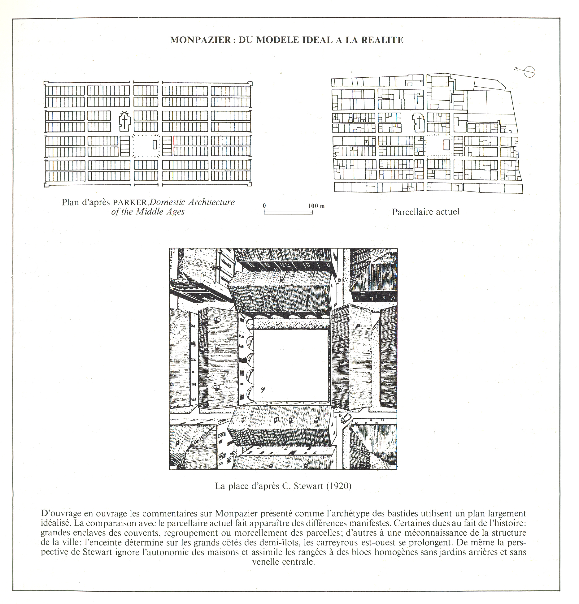

Like in earlier examples of the French and Italian schools of urban analysis, this book on the French Bastides - towns draws heavily on typological research. To isolate the typical, a very large number of towns has been studied on different scale levels. The analysis focuses on the typology of the towns themselves, the relationship of the internal elements such as squares, streets and churches, typology of the building blocks, the typology of the houses and their relation to other elements. Fig. 7.1 shows an idealized layout and how a real Bastide is related to that. As with the [Italian analysis of Bologna](bologna.qmd), the essence of the city is represented in this careful description of the typical. The study implies that an intimate knowledge of this is necessary for architects and urbanists to base their designs on, requiring lengthy and extremely thorough research. 

## Why use this method? 

## How does it work?

## You are ready to use this method if

## Questions you can answer 

## Steps

## Tools {#tools}

## Cases

## References

## Exercises

