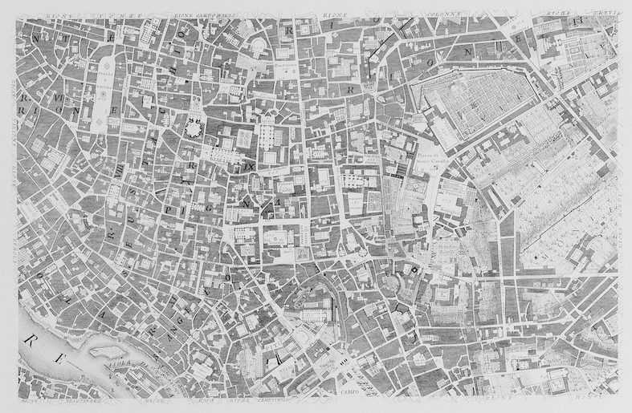
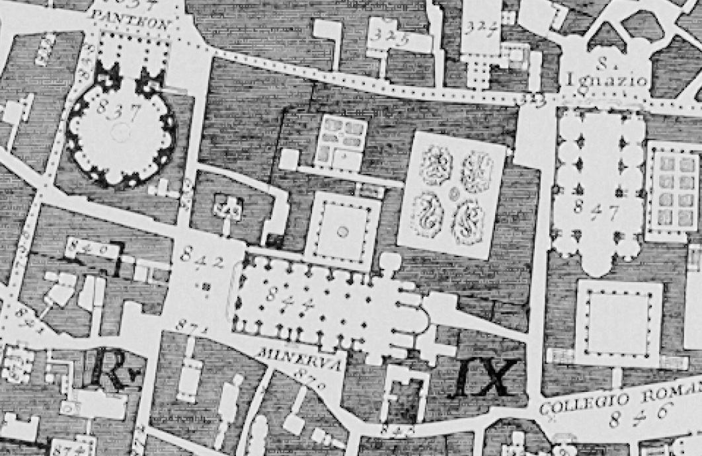

{#fig-nolli fig-align="center"}

{#fig-nolli fig-align="center"}

When most city maps were still bird’s eye perspective views, Giambattista Nolli produced a map of 18th century Rome which greatly reduced and systematised the information contained in the map (fig 12.1). Nolli limited himself to a 2d representation and only distinguished between public space (white) and private space (black). As a result, publicly accessible interior spaces like churches are visible in the map. Through reduction and abstraction, knowledge which otherwise remains hidden under the surface is instantly accessible. This is one of the basic goals of any analysis. Over the last decades, the Nolli map has mesmerised generations of urban designers, theorists and architects. Especially since the publication of [“Learning from Las Vegas”](las_vegas.qmd) (which also usedthe Nolli technique) dozens of “Nolli maps” have been produced. 
