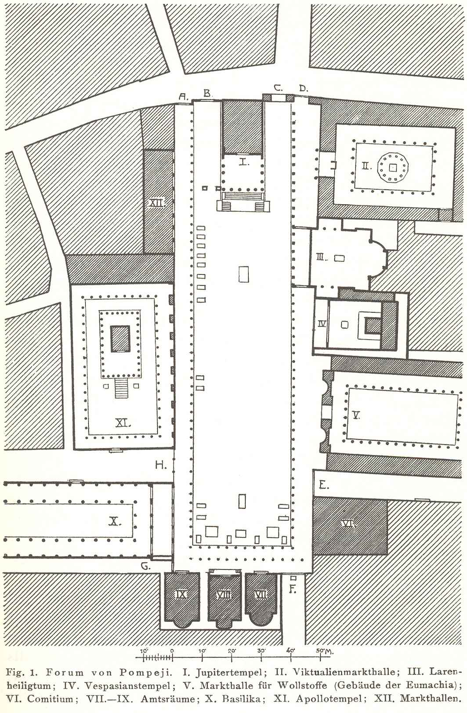

{#fig-stadtebau fig-align="center"}

Through his clear drawings and his texts, Camillo Sitte tried to establish principles for well-designed public spaces. With ancient Greek and Roman cities as basic models, Sitte’s book presents a multitude of examples of good public spaces and explains in his texts why these are good, as shown in Figure 1. He uses this knowledge to also show the reader examples of how things have gone terribly wrong in contemporary cities. Perspectives are included to further illustrate his point. His texts cannot be included here. The main interest is in the precision and delicacy of the drawings.
