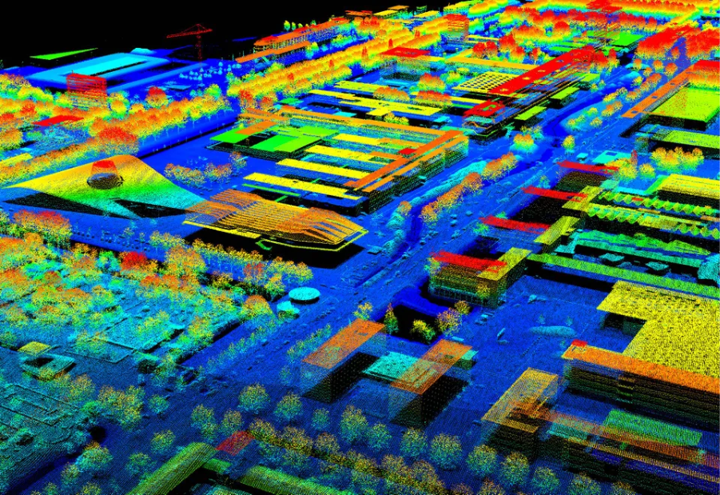

## Why use this method? 
3D scanning, particularly LiDAR (Light Detection and Ranging), is an incredibly useful tool for urban analysis, providing precise, high-resolution 3D data of environments. The Netherlands has been at the forefront of LiDAR and 3D mapping with the creation of [3DBAG](https://3dbag.nl/en/viewer) in 2008, an open dataset that boast 99% validity, far surpassing the typical 55% accuracy found in similar datasets of the same size.\

LiDAR is a remote sensing technology that works by emitting laser pulses towards a surface. These pulses travel to the target and back to the sensor and, based on the time it takes for them to return, the system calculates the distance to the target. This is known as the "time of flight."  Using this distance, the system calculates the exact 3D coordinates (X, Y, Z) of the point where the pulse has reflected, creating a “point” in 3D space. This process is repeated rapidly, generating millions of points, which together form a dense "point cloud" that can be used to construct highly detailed models of the environment.\

LiDAR can be deployed from various platforms: airborne for large-scale mapping, drones for smaller, more specific areas, ground-based for detailed mapping of buildings and infrastructure, and mobile (vehicle-mounted) for road and urban mapping.\

Methods like this are useful for creating 3D models, which you can try for yourself by following the steps below.\

{#fig-urban-taxonomy fig-align="center"}

## You are ready to use this method if

## Steps
**Step A: Create a 3D model of your point cloud**

- First, you need to access or create the point cloud data. There are several websites (such as PDOK, AHN) from which point cloud data can be downloaded, or municipal data portals, depending on the region you're working with. If there is no point cloud data available, go to step B.  

- Point cloud data typically comes in formats like LAS, LAZ, PLY, XYZ, or E57.  

- Import the point cloud data into software like CloudCompare or FME.  

- Preprocess and clean the point cloud if this is needed. Point cloud data can sometimes contain noise or irrelevant points. Software like CloudCompare has tools you can use to do this. Besides this, point cloud data can be very large. If the dataset is too large for your system to handle, consider down sampling the points/ or clip the area you want to keep. CloudCompare allows you to apply filters, like smoothing, to reduce irregularities or artifacts in the data. 

- If your data consists of multiple point clouds from different scans or sources, you'll need to align and register them into a single, unified point cloud. Also CloudCompare provides tools for automatically aligning or manually registering multiple point clouds. 

- Once you have a clear, aligned point cloud, you can generate a mesh, which is a 3D surface model. This step involves connecting the points to form triangles or polygons (more about this: Hugo's terrain modelling course). In Cloudcompare, you can use tools like Poisson Surface Reconstruction to create a mesh from the point cloud.  

- Once you have a mesh, you may need to smooth, refine, or adjust it to better represent the real-world surface. Use CloudCompare 

- Once you have your final 3D model, you can export it in various file formats, depending on your needs. Common formats include OBJ, STL, FBX, or PLY. You can 3D print this, which is very fun!  

**Step B: Create your own point cloud**

Depending on your resources and project requirements, you can use different techniques to create a point cloud. This ranges from photogrammetry with a regular camera or smartphone to more advanced options like LiDAR sensors on iPhones or drones. In this step, we'll break down some options. 

- Photogrammetry (using a regular camera or smartphone)  

  - Using a regular camera or smartphone, you can capture overlapping photos of an object or area from different angles. Pipelines like COLMAP can be used to process these images into a point cloud. This method is affordable and accessible but less precise than LiDAR or other advanced techniques. COLMAP is an open-source photogrammetry tool that performs structure-from-motion (SfM) and multi-view stereo (MVS) to create accurate 3D reconstructions from images. 

- iPhone with LiDAR sensor  

  - Newer iPhones (iPhone 12 Pro and later) feature built-in LiDAR sensors, offering better accuracy than regular photos. This allows for detailed, real-time 3D scans. Apps like 3D Scanner App let you create 3D models directly on your phone, making it ideal for small-scale projects. 	 

- Drone or airplane (for large-scale projects):  

  - Drones or airplanes equipped with cameras or LiDAR sensors are perfect for capturing large areas, such as mapping cities or landscapes. Drones offer high resolution and flexibility but come with a higher cost and require more expertise to operate. 

## Questions you can answer 

## Tools

## Cases
- [3dbag](https://3dbag.nl/en/viewer) 
- [Multi roof EU project](https://multiroofs.nweurope.eu/)

## References

## Exercises
### Exercise-1