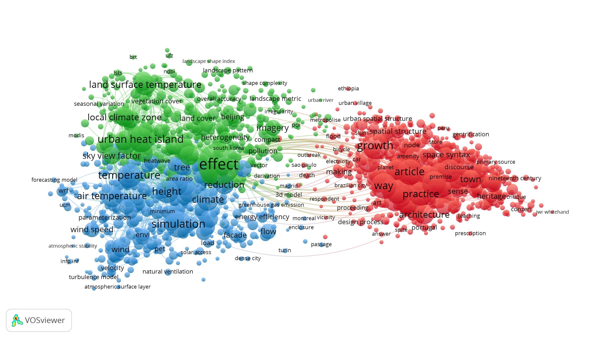

## Overview
This chapter explores emerging frontiers in urban morphology: urban morphometrics, spatial morphology, and spatial data science. Urban morphometrics is a quantitative field aiming at extracting patterns from large amounts of morphological data; spatial morphology expands the field to the analysis of unbuilt space mostly using space syntax theory and landscape ecology principles; spatial data science as a cross-cutting field increasingly adopts urban morphological information to enrich the understanding of spatial phenomena of environmental, social and economic kind.




## Techniques


## Methods
```{r echo=FALSE, message=FALSE, warning=FALSE}
library(igraph)
library(visNetwork)
library(dplyr)
library(htmlwidgets)

# 1. Load your data
nodes <- data.frame(
  id = 1:31,
  label = c("The Concise Townscape", "Les Bastides", "The Memory of the City", 
            "Urban Typology (quantitative)", "Spacematrix", "Roma al tempo di Benedetto XIV",
            "Die Städtebau nach seinen künstlerischen Grundsätzen", "La Ville Radieuse",
            "Studi per una Operante Storia Urbana di Venezia", "Bologna", "Collage City",
            "Elements d’analyse urbaine", "Lecture d’une ville: Versailles", 
            "Amsterdam als stedelijk bouwwerk", "Rotterdam Verstedelijkt Landschap",
            "La Metropole Imaginaire: un Atlas de Paris", 
            "Landschap en Verstedelijking tussen Den Haag en Rotterdam", 
            "Gli orizzonti della città diffusa", "Point City - South City",
            "Paris des Faubourgs: Formation, Transformation", "Het Land in de Stad",
            "Stadsportretten", "Zee van Land", "4", "Een nieuwe oude jas", 
            "IJburg, Haveneiland en Rieteilanden", "Haarlemmermeer", 
            "Barcelona, The Evolution of A Compact City", "Measuring Pompeii",
            "Ephemeral Urbanisms: Kumbh Mela, India", "Urban Taxonomy"),
  title = c("The Concise Townscape", "Les Bastides", "The Memory of the City", 
            "Urban Typology (quantitative)", "Spacematrix", "Roma al tempo di Benedetto XIV",
            "Die Städtebau nach seinen künstlerischen Grundsätzen", "La Ville Radieuse",
            "Studi per una Operante Storia Urbana di Venezia", "Bologna", "Collage City",
            "Elements d’analyse urbaine", "Lecture d’une ville: Versailles",
            "Amsterdam als stedelijk bouwwerk", "Rotterdam Verstedelijkt Landschap",
            "La Metropole Imaginaire: un Atlas de Paris",
            "Landschap en Verstedelijking tussen Den Haag en Rotterdam", 
            "Gli orizzonti della città diffusa", "Point City - South City",
            "Paris des Faubourgs: Formation, Transformation", "Het Land in de Stad",
            "Stadsportretten", "Zee van Land", "4", "Een nieuwe oude jas", 
            "IJburg, Haveneiland en Rieteilanden", "Haarlemmermeer",
            "Barcelona, The Evolution of A Compact City", "Measuring Pompeii",
            "Ephemeral Urbanisms: Kumbh Mela, India", "Urban Taxonomy"),
  url = c("../catalog/examples/concise_townscape.html", "../catalog/examples/les_bastides.html",
          "../catalog/examples/memory_of_the_city.html", "../catalog/examples/typology_construction_quantitative.html",
          "../catalog/examples/space_matrix.html", "../catalog/examples/roma_al_tempo_di_benedetto.html",
          "../catalog/examples/stadtebau.html", "../catalog/examples/ville_radieuse.html",
          "../catalog/examples/studi_per_una_operante.html", "../catalog/examples/bologna.html",
          "../catalog/examples/collage_city.html", "../catalog/examples/elements_urbaine.html",
          "../catalog/examples/versailles.html","../catalog/examples/stedelijk_bouwwerk.html",
          "../catalog/examples/verstedelijkt_landschap.html", "../catalog/examples/la_metropole_imaginaire.html",
          "../catalog/examples/landschap_en_verstedelijking.html",
          "../catalog/examples/gli_orizzonti.html", "../catalog/examples/point_city.html",
          "../catalog/examples/paris_des_faubourgs.html", "../catalog/examples/het_land_in_de_stad.html",
          "../catalog/examples/stadsportretten.html", "../catalog/examples/zee_van_land.html",
          "../catalog/examples/bindels_gietema.html", "../catalog/examples/een_nieuwe_oude_jas.html",
          "../catalog/examples/ijburg.html", "../catalog/examples/haarlemmermeer.html",
          "../catalog/examples/evolution_of_a_compact_city.html", "../catalog/examples/measuring_pompeii.html",
          "../catalog/examples/kumbh_mela.html", "../catalog/examples/urban_taxonomy.html"),
  stringsAsFactors = FALSE
)

nodes <- nodes %>%
  mutate(color = case_when(
    label %in% c("The Concise Townscape", "Urban Typology (quantitative)", "Les Bastides",
                 "The Memory of the City", "Spacematrix") ~ "#ff7f0e", # Bright Orange
    TRUE                 ~ "#2B7CE9"  # Default Blue for everything else
  ))

edges <- data.frame(
  from = c(1, 2, 4, 6, 6, 6, 6, 6),
  to = c(3, 3, 5, 7, 8, 9, 11, 14),
  value = c(1, 1, 1, 1, 1, 1, 1, 1) # Relation strength
) %>%
  mutate(
    # Use a power function to make 'strong' relations significantly shorter
    length = 200 / value
  )

# 2. The Plot with "Deep Peeling" Logic
visNetwork(nodes, edges) %>%
  visNodes(shape = "dot") %>%
  visEdges(
    smooth = list(enabled = FALSE)
  ) %>%
  visPhysics(
  solver = "forceAtlas2Based",
  forceAtlas2Based = list(
    springLength = 0,        # Crucial: forces it to use your 'length' column
    springConstant = 0.2,    # Higher = stronger 'pull' between related nodes
    gravitationalConstant = -25, # Lower negative = nodes push away LESS (brings them closer)
    centralGravity = 0.005
  ),
  stabilization = TRUE
) %>%
  visInteraction(zoomView = FALSE, dragView = TRUE) %>%
  visOptions(nodesIdSelection = TRUE) %>%
  # ALL your JavaScript events go in this one function:
  visEvents(
    # 1. Your working Navigation Logic
    selectNode = htmlwidgets::JS("
      function(params) {
        var clickedId = params.nodes;
        var allNodes = this.body.data.nodes.get();
        var targetNode = allNodes.find(function(node) {
          return node.id == clickedId;
        });
        if (targetNode && targetNode.url) {
          window.location.href = targetNode.url;
        }
      }
    ")
  )


```


```{r echo=FALSE, message=FALSE, warning=FALSE}
# load packages
library(leaflet)
library(sf)
library(mapview)
library(here)
library(raster)
library(magrittr)
library(leafsync)

# load morphology data
buildings <- st_read(here("data-for-map/delft_buildings.gpkg")) |> st_transform(4326)

# load maps
map1 <- leaflet() |>
  addProviderTiles("Esri.WorldImagery") |>
  setView(lng = 4.4777, lat = 51.9244, zoom = 13) |>  # Rotterdam coordinates
  # addPolygons(
  #   data = buildings,
  #   color = "orange",
  #   weight = 0.2,
  #   opacity = 1,
  #   fillOpacity = 1,
  #   group = "Buildings",
  #   popup = ~paste("gebruiksdoel", ifelse(!is.na(gebruiksdoel), gebruiksdoel, "N/A"))
  # ) |>
  addScaleBar(position = "bottomleft") |>
  addMiniMap(toggleDisplay = TRUE) |>
  addLayersControl(
    baseGroups = c("Base Map"),
    overlayGroups = c("Buildings"),
    options = layersControlOptions(collapsed = FALSE)
  )

map2 <- leaflet() %>%
  setView(lng = 4.4777, lat = 51.9244, zoom = 13) %>%
  addTiles() %>%  # Base OSM layer
  addTiles(
    urlTemplate = "https://allmaps.xyz/maps/8ebee9ef638a08cf/{z}/{x}/{y}.png",
    attribution = "Allmaps",
    options = tileOptions(opacity = 0.7)  # Optional: make it semi-transparent
  )

leafsync::sync(map1, map2)

```


